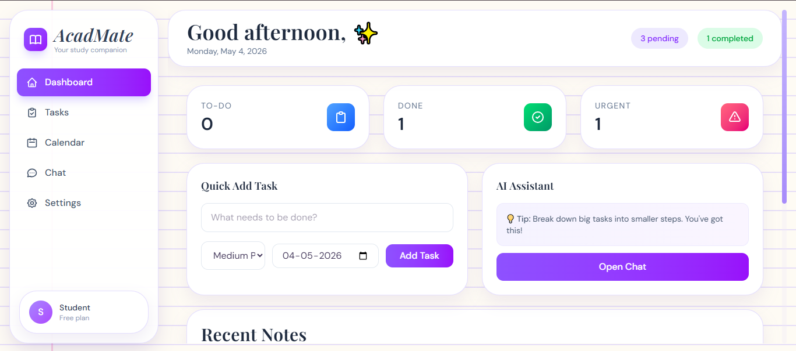
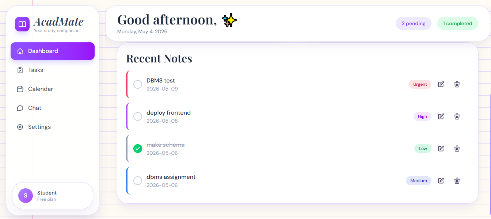
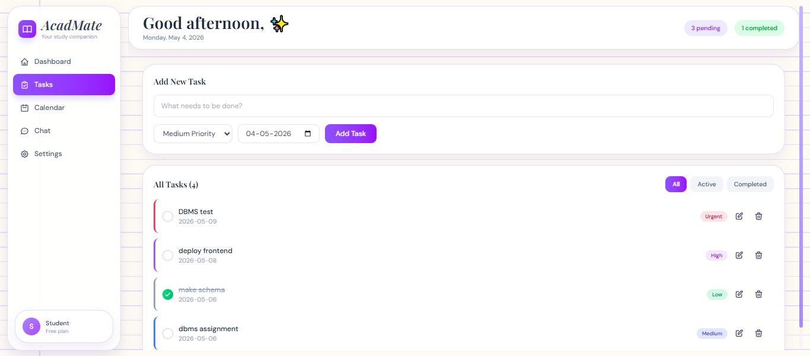
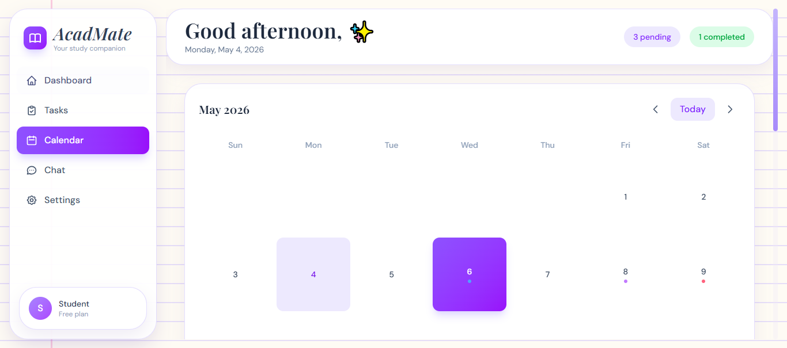
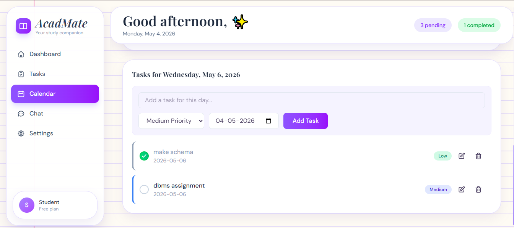
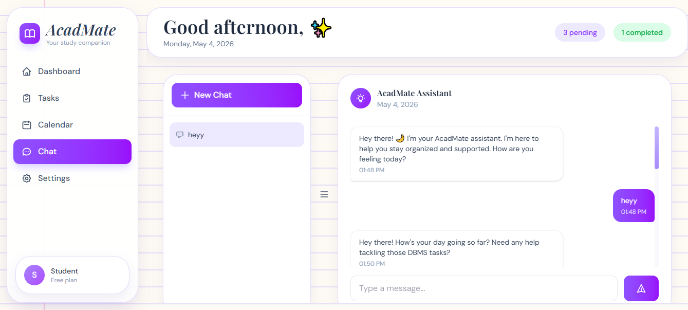
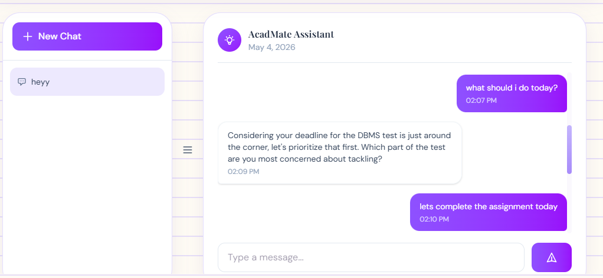
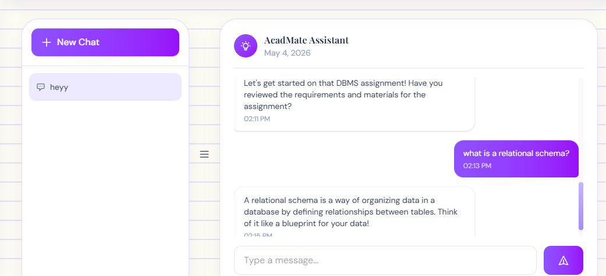

# 🌙 AcadMate

A soft little productivity space with a brain.

AcadMate is a full-stack academic productivity app that helps you manage tasks, stay organized, and get gentle AI-powered planning support — all in one place.

---
## 🖼️ Preview










---


## ✨ What it does

- 📝 Create and manage tasks with priorities  
- 📅 Track work using a calendar view  
- 💬 Chat with an AI assistant for planning help  
- 🧠 Remembers your conversations  
- 💾 Saves everything using a real database (Supabase)  
- 🔔 Gives simple daily reminders for important tasks  

---

## 🧠 Tech Stack

**Frontend**
- React + TypeScript
- Vite
- Tailwind CSS

**Backend**
- FastAPI (Python)

**Database**
- Supabase (PostgreSQL)

**AI**
- Ollama (local LLM - Llama 3.2)

---

## 🏗️ How it works
Frontend (React)
↓
Supabase (Database)
↓
Backend (FastAPI)
↓
Local AI (Ollama)


---

## 🚀 Run locally

### 1. Clone the project

```bash
git clone YOUR_REPO_URL
cd acadmate-redesigned

2. Install frontend
npm install
3. Add environment variables

Create a .env file in the root:

VITE_SUPABASE_URL=your_supabase_url
VITE_SUPABASE_ANON_KEY=your_supabase_key
VITE_API_URL=http://127.0.0.1:8000
4. Setup backend
cd backend
python -m venv ../venv
../venv/Scripts/Activate.ps1
pip install -r requirements.txt
5. Setup AI (optional but recommended)

Install Ollama:
https://ollama.com

Then run:

ollama pull llama3.2
ollama run llama3.2
6. Start backend
uvicorn main:app
7. Start frontend
npm run dev

Open:

http://localhost:5173
🌐 Deployment
Frontend → Vercel
Database → Supabase
AI → runs locally (not deployed in free hosting)
⚠️ Important note

The AI assistant uses local Ollama, so:

Works perfectly on your machine
Deployed version may not include AI unless a cloud API is added
💭 Why this exists

Most productivity apps are either:

too complicated
too boring
or don’t actually help you think

AcadMate tries to be:

simple, calm, and actually helpful

Built a full-stack productivity app using React, FastAPI, Supabase, and locally hosted LLMs via Ollama for task-aware planning and persistent chat.